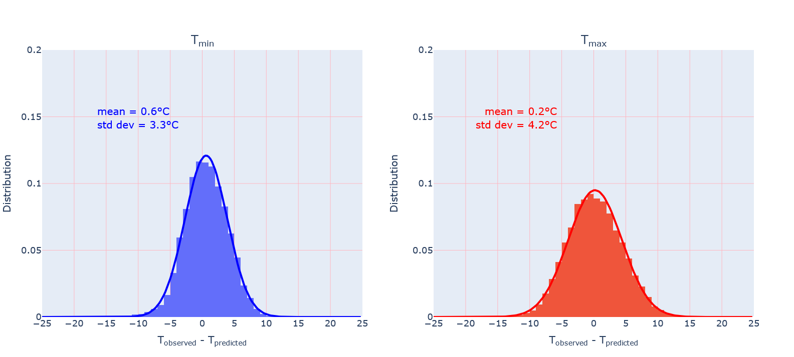

# Temperature Prediction Study

From basic models based on random sampling to evolved ones, how do these models perform compare with weather forecast specialists when trying to predict temperatures?  

## Requirements

- beautifulsoup

- datetime

- io

- pandas

- numpy

- requests

# Data collection

## Construction of historical database

The database is constructed from National Oceanic and Atmospheric Administration (NOAA) data.

The NOAA API documentation can be found from https://www.ncdc.noaa.gov/cdo-web/webservices/v2#gettingStarted

The script construct_temp_prcp_database.py extracts daily minimal and maximal temperatures as well as precipitations for a user-defined range of years.

## Construction of observations file

python construct_observations.py

Observations for min and max temperatures starting from April, 1st 2021 are taken from NOAA database. The script should regularly be run. Unfortunately, data are sometimes missing

## Construction of predictions file

python construct_predictions.py

Predictions for min and max temperatures of Paris area are taken from https://www.meteo-paris.com/ile-de-france/previsions The script should be run everyday.

# Models

## Model 1

Predict temperatures on a given day of year by sampling these temperatures on the same day of a year chosen randomly in the preceding 40 years.

Example: min and max temperatures on April, 1st 1987 predicted from min and max temperatures on April, 1st on a year randomly sampled between 1947 and 1986.

The distribution below (bar plots) was obtained for daily predictions of min and max temperatures between 1940 and 2000 excluding leap years.

The solid lines are normal distribution functions with mean and standard deviation values obtained from the data in the bar plots. 

A possible interpretation of the plots is the following. If one attempts to predict the minimum temperature of a given day by randomly sampling the minimum temperature of this day over the previous 40 years, and if we perform this kind of prediction a large number of times, i.e. during decades, the distance between the prediction and the actual temperature will be less than 1 degree on average (low bias).

However, on average two out of three predictions will be within 5 degree of the observed temperature (high variance). This is not very useful if we want to predict whether it is going to freeze. The plot also shows that it is not rare to be wrong by 10 degrees with model 1.

## Model 2

Calculate temperatures on a given day as the mean temperatures of this day over the previous 40 years.

Example: min temperature on April, 1st 1987 calculated as the min temperature mean on April, 1st between 1947 and 1986.

The distribution below (bar plots) was obtained for daily predictions of min and max temperatures between 1940 and 2000 excluding leap years.

The solid lines are normal distribution functions with mean and standard deviation values obtained from the data in the bar plots. 

Model 2 does a slightly better job than model 1 because it yields lower variance. This observation means that the predicitions arising from model 2 on average fall closer to the observed value.

## Model 5

According to this model the following day temperatures is taken as the current day's temperatures.

Example: min temperature for April, 2nd 1987 is taken as min temperature on April, 1st 1987.

The solid lines are normal distribution functions with mean and standard deviation values obtained from the data in the bar plots. 

This model is perhaps the simplest one can think of to predict the following day's temperatures. Nevertheless, it performs better than model 1 and model 2. On average, the predicted value falls within less than 0.1°C from the actual temperature.