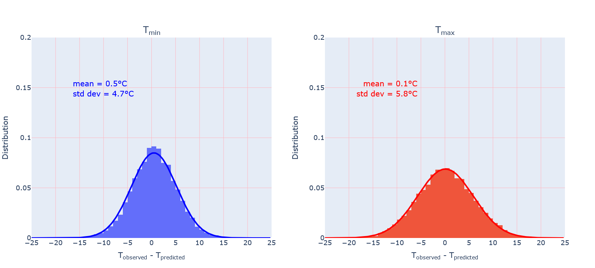

# Temperature Prediction Study

From basic models based on random sampling to evolved ones, how do these models perform compare with weather forecast specialists when trying to predict temperatures?  

## Requirements

- beautifulsoup

- datetime

- io

- pandas

- numpy

- requests

# Data collection

## Construction of historical database

The database is constructed from National Oceanic and Atmospheric Administration (NOAA) data.

The NOAA API documentation can be found from https://www.ncdc.noaa.gov/cdo-web/webservices/v2#gettingStarted

The script construct_temp_prcp_database.py extracts daily minimal and maximal temperatures as well as precipitations for a user-defined range of years.

## Construction of observations file

python construct_observations.py

Observations for min and max temperatures starting from April, 1st 2021 are taken from NOAA database. The script should regularly be run. Unfortunately, data are sometimes missing

## Construction of predictions file

python construct_predictions.py

Predictions for min and max temperatures of Paris area are taken from https://www.meteo-paris.com/ile-de-france/previsions The script should be run everyday.

# Models

## Model 1

Predict temperatures on a given day of year by sampling these temperatures on the same day of a year chosen randomly in the preceding 40 years.

Example: min and max temperatures on April, 1st 1987 predicted from min and max temperatures on April, 1st on a year randomly sampled between 1947 and 1986.

## Model 2

Calculate temperatures on a given day as the mean temperatures of this day over the previous 10, 20, 30... years.

Example: min temperature on April, 1st 1987 calculated as the min temperature mean between 1947 and 1986.  